# Cognitive Memory Engine


> A full-stack AI-powered learning intelligence platform that transforms study activity into structured memories, semantic retrieval, personalized analytics, and learning recommendations.

## Overview

Cognitive Memory Engine is a production-style AI learning platform designed to help users capture, organize, retrieve, and understand their learning history.

The system allows users to create Learning Tracks, log study sessions, store structured memories, generate vector embeddings, perform semantic retrieval, interact through Retrieval-Augmented Generation (RAG), and receive analytics-driven recommendations.

Unlike traditional note-taking applications, Cognitive Memory Engine combines semantic memory, vector search, analytics, and recommendation systems to create a searchable and actionable learning knowledge base.

---
## Why This Project?

Traditional note-taking systems store information but do not help users understand learning progress.

Cognitive Memory Engine transforms study activity into structured memories, semantic retrieval, analytics, and personalized recommendations, creating a searchable learning intelligence system.

---

## Live Demo

Frontend:
https://cognitive-memory-frontend-244986175934.asia-south1.run.app/

Backend API:
https://cognitive-memory-backend-244986175934.asia-south1.run.app/docs

---
## Project Highlights

- Built a full-stack AI Learning Intelligence Platform using FastAPI, PostgreSQL, pgvector, Gemini 2.5 Flash, and Next.js
- Implemented semantic memory retrieval using vector embeddings and HNSW indexing
- Developed a Retrieval-Augmented Generation (RAG) pipeline with source attribution
- Built analytics services for learning progress, consistency tracking, and topic analysis
- Designed a recommendation engine for neglected topics, weak areas, and learning continuity
- Deployed frontend and backend services on Google Cloud Run
- Integrated Neon PostgreSQL with pgvector for scalable semantic search
## Core Learning Pipeline

```text
Learning Track
        ↓
    Study Log
        ↓
      Memory
        ↓
     Embedding
        ↓
 Semantic Retrieval
        ↓
       RAG
        ↓
    Analytics
        ↓
  Recommendations
```
## Screenshots

### Dashboard Overview

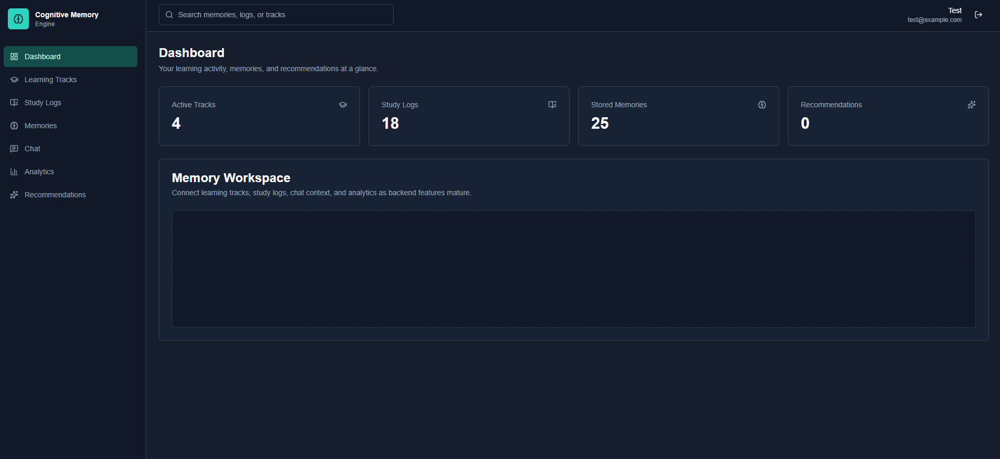

---

### Semantic RAG Chat

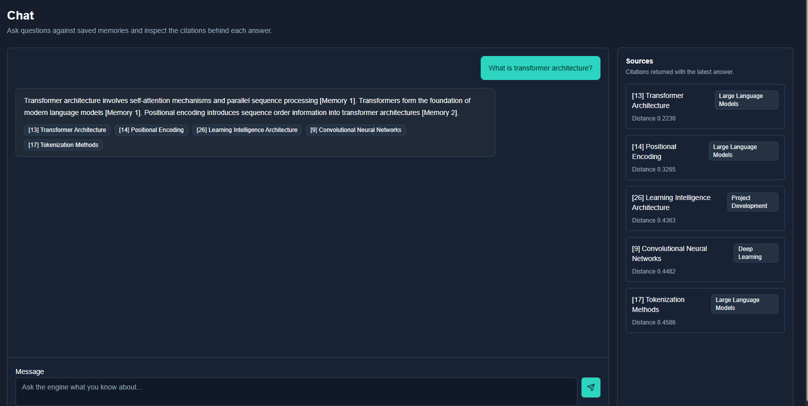

---

### Analytics Dashboard

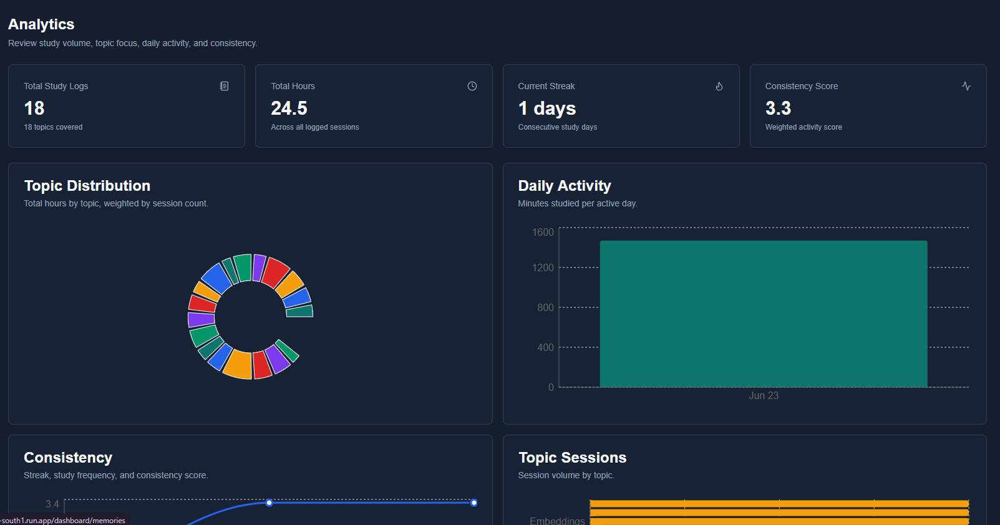

---

### Recommendations Engine

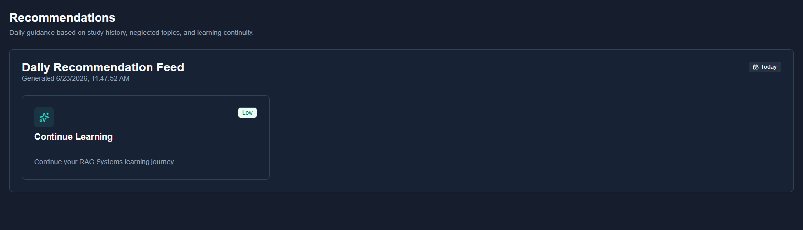

---


--
 

## Key Features

### Authentication

* User registration and login
* JWT-based authentication
* Protected API endpoints
* Current user profile management

### Learning Management

* Learning Track management
* Study Log management
* Memory management
* User-specific data isolation

### Semantic Memory Layer

* Automatic embedding generation
* BAAI/bge-base-en-v1.5 embeddings
* pgvector vector storage
* HNSW vector indexing
* Semantic memory search

### Retrieval-Augmented Generation (RAG)

* Memory-aware question answering
* Gemini 2.5 Flash integration
* Context-grounded responses
* Source attribution
* Conversation persistence

### Analytics

* Learning overview dashboard
* Topic distribution analysis
* Study hours tracking
* Daily learning activity tracking
* Study consistency metrics
* Study streak calculation
* Neglected topic detection

### Recommendations

* Continue-learning recommendations
* Weak-area identification
* Neglected-track detection
* Daily recommendation feed

### Deployment

* Dockerized backend
* Dockerized frontend
* Google Cloud Run deployment
* Neon PostgreSQL integration

---

## High-Level Architecture
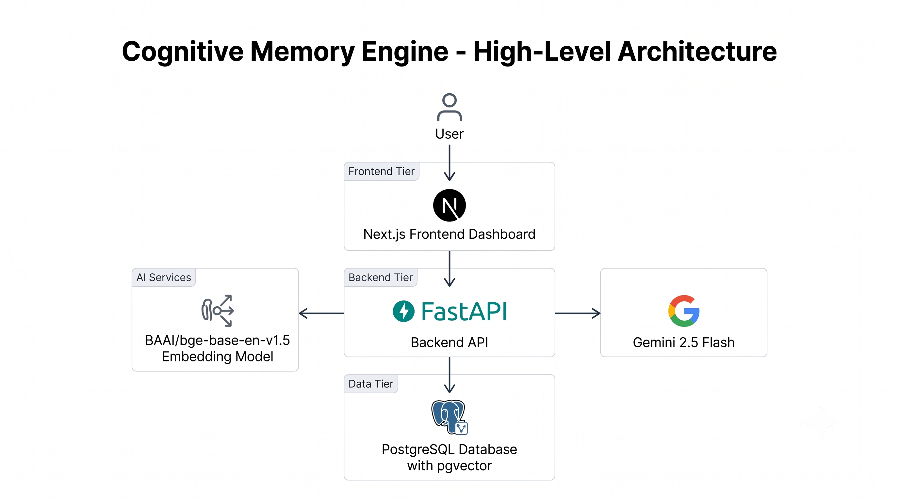
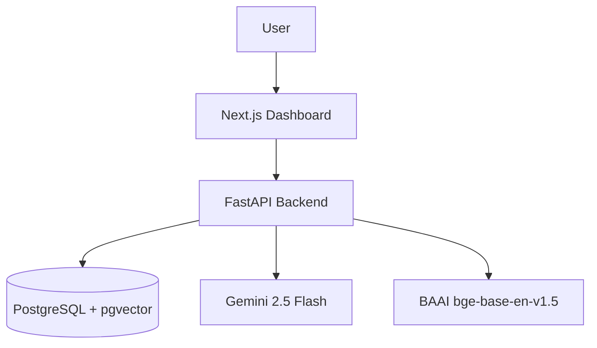

---

## RAG Architecture
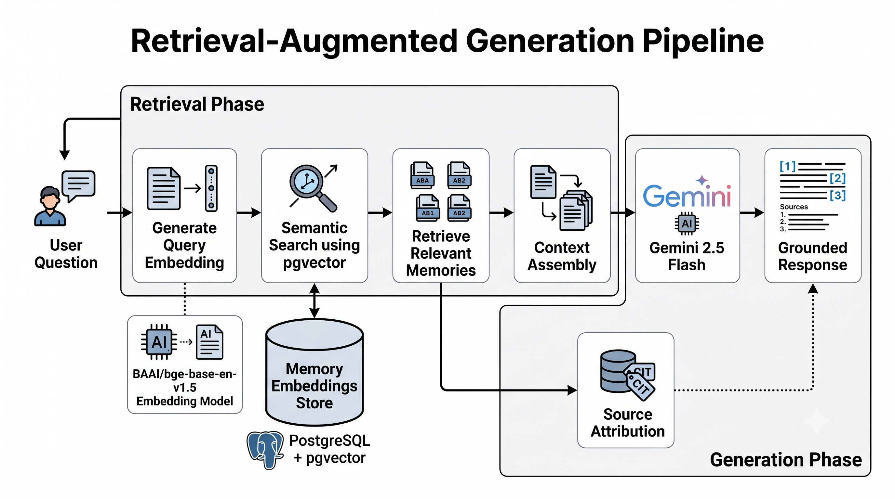
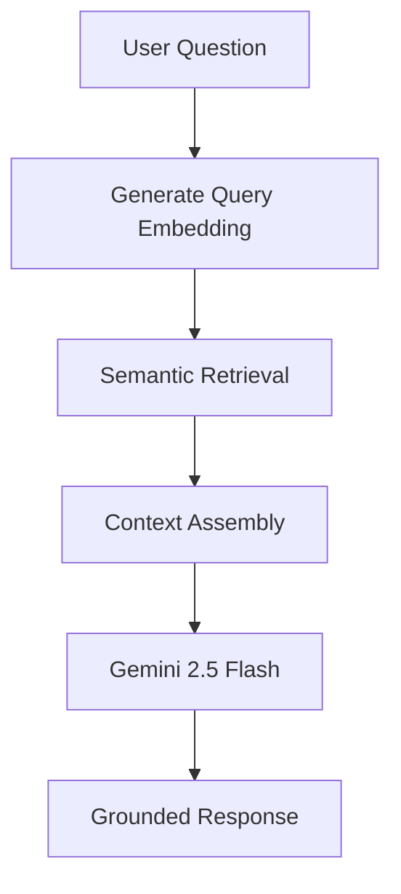

---

## Learning Intelligence Architecture
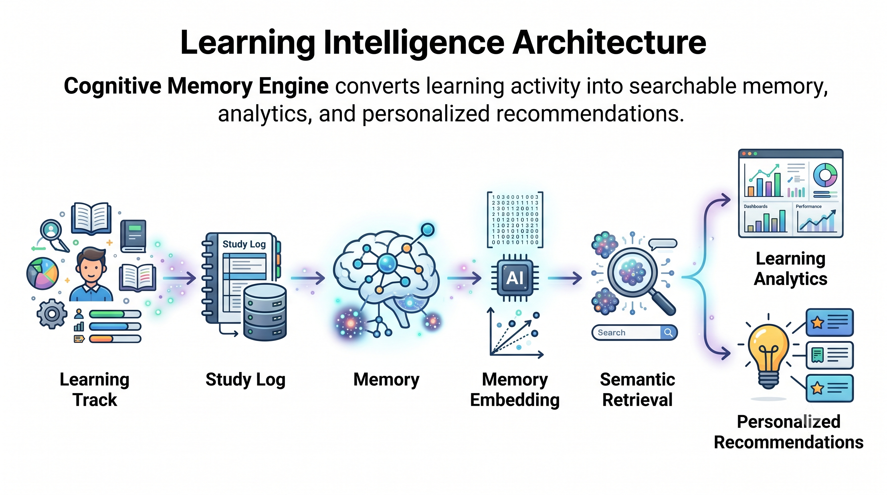
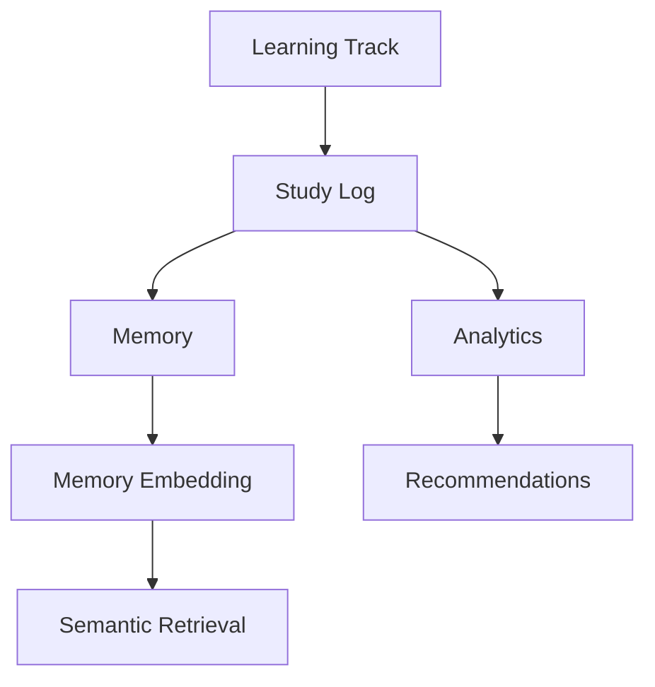

---

## Deployment Architecture
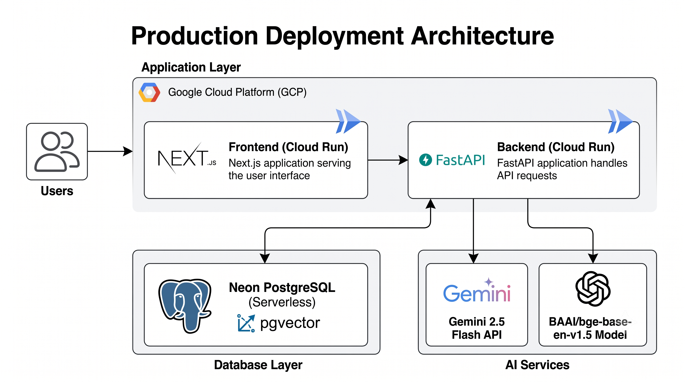
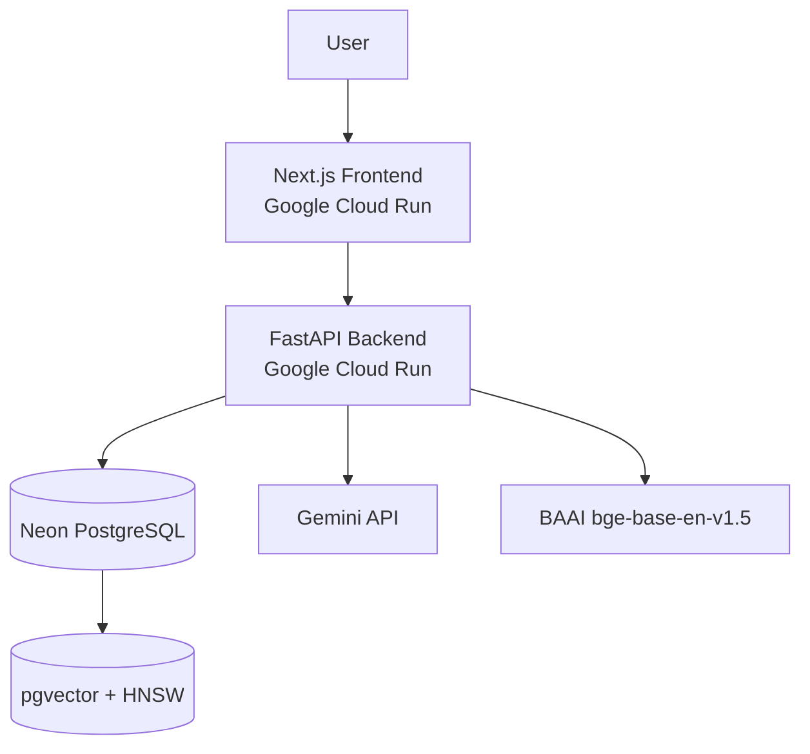

---
## Repository Structure

```text
cognitive-memory-engine/
├── backend/
├── frontend/
├── docs/
│   ├── architecture/
│   └── screenshots/
├── diagrams/
├── README.md
├── PROJECT_ARCHITECTURE_REPORT.md
├── PROJECT_PROGRESS.md
└── LICENSE
```
## Technology Stack

### Backend

* FastAPI
* SQLAlchemy
* PostgreSQL
* Alembic
* pgvector
* JWT Authentication
* Gemini 2.5 Flash
* Sentence Transformers
* BAAI/bge-base-en-v1.5

### Frontend

* Next.js
* TypeScript
* Tailwind CSS
* shadcn/ui
* Recharts
* Axios

### Deployment

* Docker
* Google Cloud Run
* Google Artifact Registry
* Neon PostgreSQL

---

## Database Design

### Core Entities

```text
User
├── LearningTrack
│     └── StudyLog
│            └── Memory
│                    └── MemoryEmbedding
├── Conversation
└── UsageLimit
```

### Vector Search

* Embedding model: BAAI/bge-base-en-v1.5
* Vector dimension: 768
* Storage: PostgreSQL + pgvector
* Similarity metric: Cosine similarity
* Index type: HNSW

---

## API Overview

### Authentication

* POST /register
* POST /login
* GET /me

### Learning Tracks

* POST /learning-tracks
* GET /learning-tracks
* PUT /learning-tracks/{id}
* DELETE /learning-tracks/{id}

### Study Logs

* POST /study-logs
* GET /study-logs
* PUT /study-logs/{id}
* DELETE /study-logs/{id}

### Memories

* POST /memories
* GET /memories
* PUT /memories/{id}
* DELETE /memories/{id}
* POST /memories/search

### RAG

* POST /rag/ask

### Analytics

* GET /analytics/overview
* GET /analytics/topic-distribution
* GET /analytics/daily-activity
* GET /analytics/consistency

### Recommendations

* GET /recommendations/daily

---

## Local Setup

### Backend

```bash
cd backend

python -m venv .venv

source .venv/bin/activate

pip install -r requirements.txt
```

Create `.env`:

```env
DATABASE_URL=
SECRET_KEY=
GEMINI_API_KEY=
ACCESS_TOKEN_EXPIRE_MINUTES=720
```

Run:

```bash
uvicorn app.main:app --reload
```

---

### Frontend

```bash
cd frontend

npm install
```

Create `.env.local`:

```env
NEXT_PUBLIC_API_URL=http://localhost:8000
```

Run:

```bash
npm run dev
```

---

## Production Deployment
### Live Deployment

Frontend:
https://cognitive-memory-frontend-244986175934.asia-south1.run.app

Backend:
https://cognitive-memory-backend-244986175934.asia-south1.run.app

API Documentation:
https://cognitive-memory-backend-244986175934.asia-south1.run.app/docs
### Backend

* Dockerized FastAPI application
* Containerized with Docker
* Deployed on Google Cloud Run

### Frontend

* Dockerized Next.js application
* Deployed on Google Cloud Run

### Database

* Neon PostgreSQL
* pgvector enabled
* HNSW vector indexing

---


## Key Learnings

Through this project I gained practical experience with:

- Designing layered FastAPI backend architectures
- Implementing vector search using pgvector and HNSW indexing
- Building Retrieval-Augmented Generation systems with Gemini
- Developing analytics and recommendation pipelines
- Managing PostgreSQL databases in production
- Containerizing applications with Docker
- Deploying scalable services on Google Cloud Run
- Building full-stack applications with Next.js and TypeScript

## Future Improvements

* AI-powered voice note ingestion
* Document ingestion and file uploads
* Conversation-aware retrieval
* Agentic learning coach
* Hybrid search
* Cross-encoder reranking
* Conversation history UI
* Usage-limit enforcement
* Automated testing
* CI/CD pipeline
* Advanced learning intelligence engine

---

## License

This project is licensed under the MIT License.
