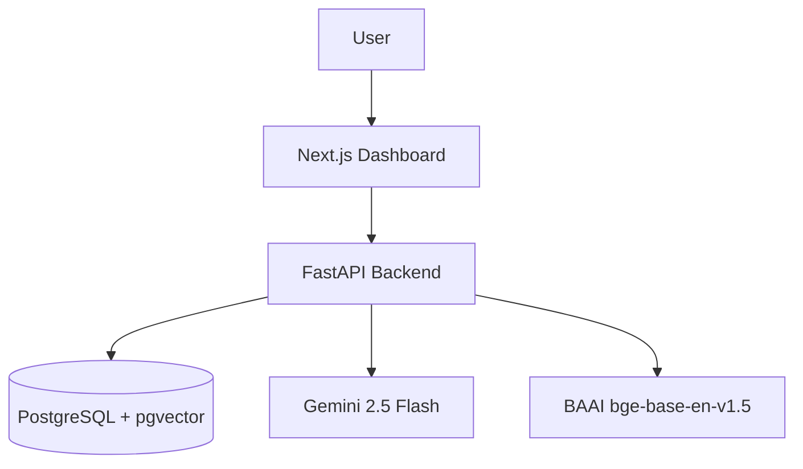
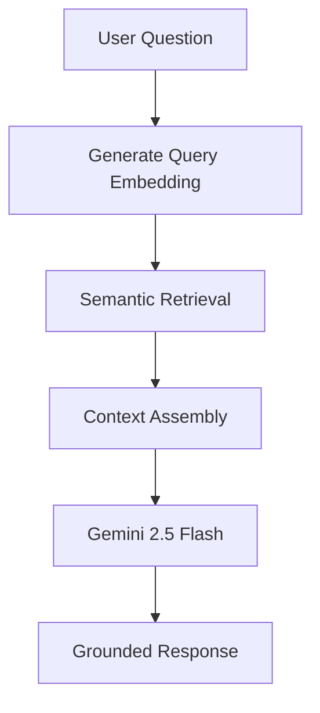
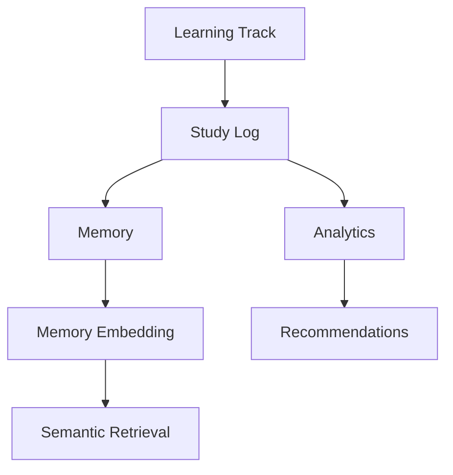
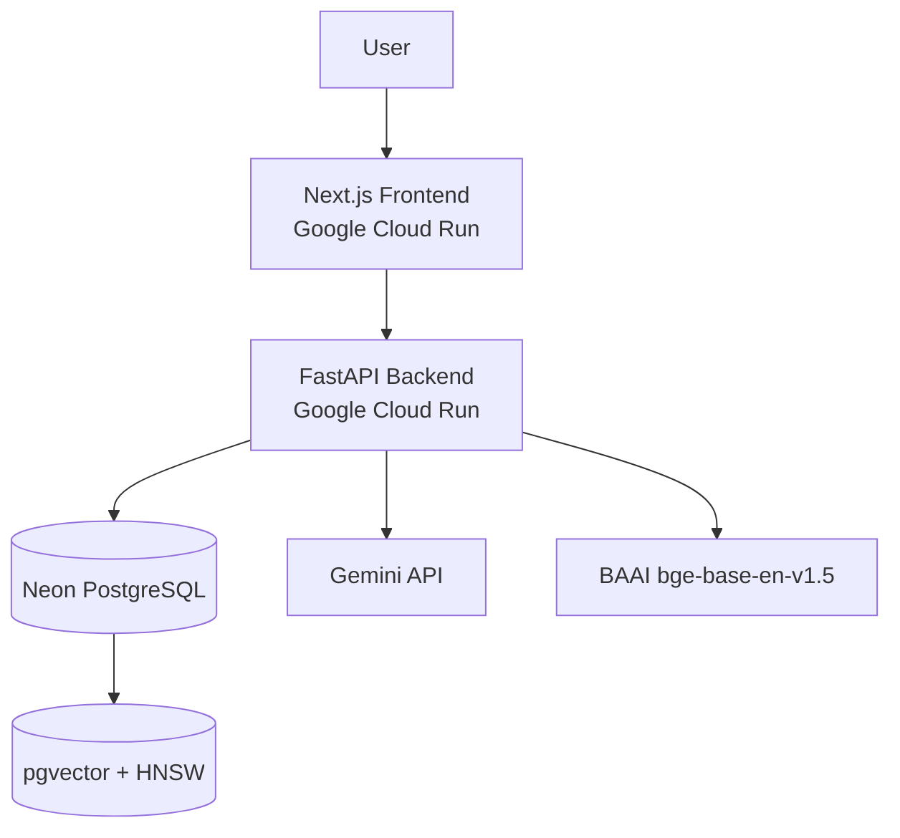

# Cognitive Memory Engine

> A full-stack AI-powered learning intelligence platform that transforms study activity into structured memories, semantic retrieval, personalized analytics, and learning recommendations.

## Overview

Cognitive Memory Engine is a production-style AI learning platform designed to help users capture, organize, retrieve, and understand their learning history.

The system allows users to create Learning Tracks, log study sessions, store structured memories, generate vector embeddings, perform semantic retrieval, interact through Retrieval-Augmented Generation (RAG), and receive analytics-driven recommendations.

Unlike traditional note-taking applications, Cognitive Memory Engine combines semantic memory, vector search, analytics, and recommendation systems to create a searchable and actionable learning knowledge base.

---

## Key Features

### Authentication

* User registration and login
* JWT-based authentication
* Protected API endpoints
* Current user profile management

### Learning Management

* Learning Track management
* Study Log management
* Memory management
* User-specific data isolation

### Semantic Memory Layer

* Automatic embedding generation
* BAAI/bge-base-en-v1.5 embeddings
* pgvector vector storage
* HNSW vector indexing
* Semantic memory search

### Retrieval-Augmented Generation (RAG)

* Memory-aware question answering
* Gemini 2.5 Flash integration
* Context-grounded responses
* Source attribution
* Conversation persistence

### Analytics

* Learning overview dashboard
* Topic distribution analysis
* Study hours tracking
* Daily learning activity tracking
* Study consistency metrics
* Study streak calculation
* Neglected topic detection

### Recommendations

* Continue-learning recommendations
* Weak-area identification
* Neglected-track detection
* Daily recommendation feed

### Deployment

* Dockerized backend
* Dockerized frontend
* Google Cloud Run deployment
* Neon PostgreSQL integration

---

## Learning Intelligence Architecture

The platform is built around a learning intelligence pipeline:

```text
Learning Track
    ↓
Study Log
    ↓
Memory
    ↓
Embedding
    ↓
Semantic Retrieval
    ↓
Analytics
    ↓
Recommendations
```

This architecture transforms raw study activity into searchable knowledge and actionable learning insights.

---

## High-Level Architecture



---

## RAG Architecture



---

## Learning Intelligence Architecture



---

## Deployment Architecture



---

## Technology Stack

### Backend

* FastAPI
* SQLAlchemy
* PostgreSQL
* Alembic
* pgvector
* JWT Authentication
* Gemini 2.5 Flash
* Sentence Transformers
* BAAI/bge-base-en-v1.5

### Frontend

* Next.js
* TypeScript
* Tailwind CSS
* shadcn/ui
* Recharts
* Axios

### Deployment

* Docker
* Google Cloud Run
* Google Artifact Registry
* Neon PostgreSQL

---

## Database Design

### Core Entities

```text
User
├── LearningTrack
│     └── StudyLog
│            └── Memory
│                    └── MemoryEmbedding
├── Conversation
└── UsageLimit
```

### Vector Search

* Embedding model: BAAI/bge-base-en-v1.5
* Vector dimension: 768
* Storage: PostgreSQL + pgvector
* Similarity metric: Cosine similarity
* Index type: HNSW

---

## API Overview

### Authentication

* POST /register
* POST /login
* GET /me

### Learning Tracks

* POST /learning-tracks
* GET /learning-tracks
* PUT /learning-tracks/{id}
* DELETE /learning-tracks/{id}

### Study Logs

* POST /study-logs
* GET /study-logs
* PUT /study-logs/{id}
* DELETE /study-logs/{id}

### Memories

* POST /memories
* GET /memories
* PUT /memories/{id}
* DELETE /memories/{id}
* POST /memories/search

### RAG

* POST /rag/ask

### Analytics

* GET /analytics/overview
* GET /analytics/topic-distribution
* GET /analytics/daily-activity
* GET /analytics/consistency

### Recommendations

* GET /recommendations/daily

---

## Local Setup

### Backend

```bash
cd backend

python -m venv .venv

source .venv/bin/activate

pip install -r requirements.txt
```

Create `.env`:

```env
DATABASE_URL=
SECRET_KEY=
GEMINI_API_KEY=
ACCESS_TOKEN_EXPIRE_MINUTES=720
```

Run:

```bash
uvicorn app.main:app --reload
```

---

### Frontend

```bash
cd frontend

npm install
```

Create `.env.local`:

```env
NEXT_PUBLIC_API_URL=http://localhost:8000
```

Run:

```bash
npm run dev
```

---

## Production Deployment

### Backend

* Dockerized FastAPI application
* Containerized with Docker
* Deployed on Google Cloud Run

### Frontend

* Dockerized Next.js application
* Deployed on Google Cloud Run

### Database

* Neon PostgreSQL
* pgvector enabled
* HNSW vector indexing

---

## Screenshots

Add screenshots for:

* Login Page
* Dashboard Overview
* Learning Tracks
* Study Logs
* Memory Management
* RAG Chat Interface
* Analytics Dashboard
* Recommendations Dashboard
* Cloud Run Deployment
* PostgreSQL Database

---

## Future Improvements

* Document ingestion and file uploads
* Conversation-aware retrieval
* Hybrid search
* Cross-encoder reranking
* Conversation history UI
* Usage-limit enforcement
* Automated testing
* CI/CD pipeline
* Advanced learning intelligence features

---

## License

This project is licensed under the MIT License.
